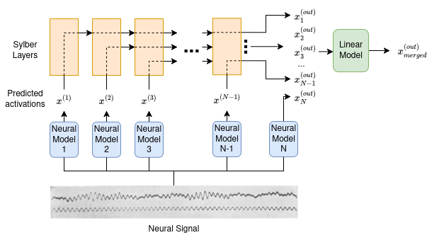

# DESCRIPTION
Decoding of syllable embeddings from neural data.

This work is heavily inspired by [this paper](https://ai.meta.com/research/publications/emergence-of-language-in-the-developing-brain/). It also builds upon the findings of [this paper](https://arxiv.org/abs/2410.07168), for which the code is available [here](https://github.com/Berkeley-Speech-Group/sylber/).

Syllables are a cognitively relevant sub-unit of speech, as such, it is a worthwhile endeavour to study their use in BCI applications.

Sylber is an improvement upon HuBERT that has learnt heavily syllable-relevant tokens. These tokens, because of their high frequency and similarity properties, provide a very rich representation for learning on neural signals. In that aspect, they may constitute an alternative to label-based brain to text decoding paradigms, which are very costly in terms of training data.

We make use of the openly available ["Podcast" ECoG dataset](https://www.nature.com/articles/s41597-025-05462-2), to try and decode these tokens from neural signals.

# HOW TO REPRODUCE
If you are reading this and have things to share (positive or negative), feel free to contact me.

- The dataset is freely available on [OpenNeuro](https://openneuro.org/datasets/ds005574/versions/1.0.2), you can download it from there or use the `ds005574-1.0.2.sh` bash script (don't forget to `chmod + x`).
- The Sylber model and related utilities can be downloaded via *pip*, though i suggest cloning the [repo](https://github.com/berkeley-speech-group/sylber/). Note that it's requirements may not work for `python > 3.11`

You can then run sylber on the audio stimulus from the dataset (don't forget to convert it to mono). the sylber output dict must be saved in a `.pickle` file. You should then be able to provide the required paths in `config.yaml` and run the different scripts. 

# to-do:
- code refactoring
- hyperparameter tuning / testing model architectures
- data augmentation
- testing features other than high-gamma binned activations (notably beta features)
- test on a spoken dataset?

Another idea I had is the following:
Instead of predicting just the last activations that directly represent syllables, we can take advantage of the hierarchical structure of the model, and try to predict syllables from neural-decoded earlier activations, that may represent other info that can be extracted from the neural signal (thus maybe leveraging similar hierarchical structure in the brain).

